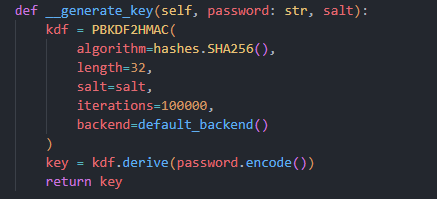
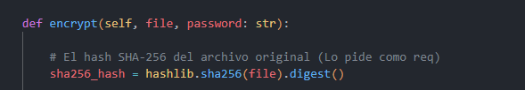
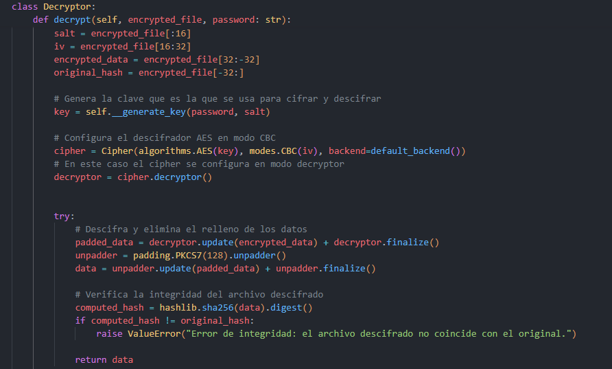

# Reporte Final de Ciberseguridad

**Integrantes:**
- Juan Felipe Castillo Gómez
- Juan Camilo Ramírez Tabares

## Cómo realizamos el proyecto

### Elección de tecnologías y arquitectura
El primer paso fue definir las tecnologías que usaríamos para desarrollar el proyecto. Decidimos utilizar una arquitectura web clásica de cliente-servidor, eligiendo Python como lenguaje principal para el modelo, empleando el framework Flask.

Tambien, optamos por implementar toda la lógica de cifrado y descifrado usando programación orientada a objetos.

### Implementación de la lógica de negocio
Como parte de la implementación del cifrado y descifrado, estudiamos la estructura de cada algoritmo para identificar los requisitos y entender su funcionamiento. Nos apoyamos en ChatGPT y en apuntes de clase (Semana 3) para guiar la implementación.

Definimos que necesitábamos un algoritmo para generar la clave a partir de una contraseña en formato de texto (string). El ejercicio especificaba que la contraseña debía emplear el algoritmo PBKDF2 y generar una clave de 256 bits.

A continuación, se solicitó que cifráramos el archivo utilizando el algoritmo AES. Implementamos AES en modo CBC, ya que ofrece mayor seguridad al asegurar que dos archivos cifrados con la misma clave no generen la misma salida.

También se solicitaba adjuntar el hash SHA-256 del archivo original para comparar la integridad al descifrarlo en el futuro.

Por último, el proceso de descifrado sigue el mismo procedimiento, pero a la inversa. Implementamos el cálculo de la clave, el algoritmo de descifrado AES en modo CBC, y la comparación del hash del archivo original con el del archivo descifrado para asegurar la integridad de la salida.

## Dificultades que enfrentamos

Durante el desarrollo del proyecto, enfrentamos diversas dificultades, entre las cuales destacamos las siguientes:

- *Comprender el proceso de descifrado:*  
   Al principio, tuvimos problemas para entender cómo desencriptar el archivo correctamente. Esto incluyó entender la relación entre el IV, la clave generada y el formato de los datos cifrados.
   
- *Validación de integridad:*  
   Configurar el cálculo y la comparación del hash SHA-256 para validar la integridad del archivo descifrado nos llevó a investigar y probar múltiples métodos para asegurar resultados consistentes.

## Conclusiones

- *Aprendizaje técnico:*  
   Este proyecto nos permitió profundizar en conceptos avanzados de ciberseguridad, como la implementación de algoritmos de cifrado (AES en CBC) y técnicas de derivación de claves (PBKDF2).

- *Importancia de la seguridad en desarrollo:*  
   Nos dimos cuenta de que la seguridad debe ser una prioridad en cualquier proyecto de software, y no un aspecto secundario.

- *Futuras mejoras:*  
   Identificamos áreas para mejorar en versiones futuras del proyecto, como la implementación de otros modos de cifrado, la integración de una interfaz más amigable y la adición de funcionalidades como la generación automática de contraseñas seguras.
